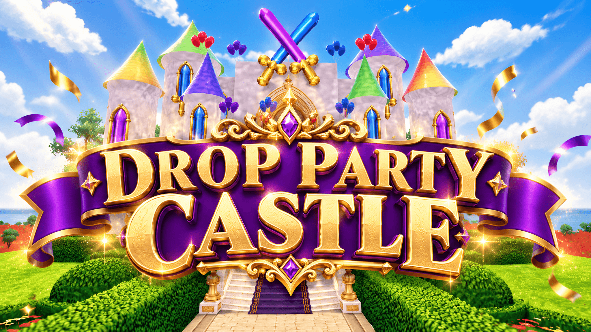
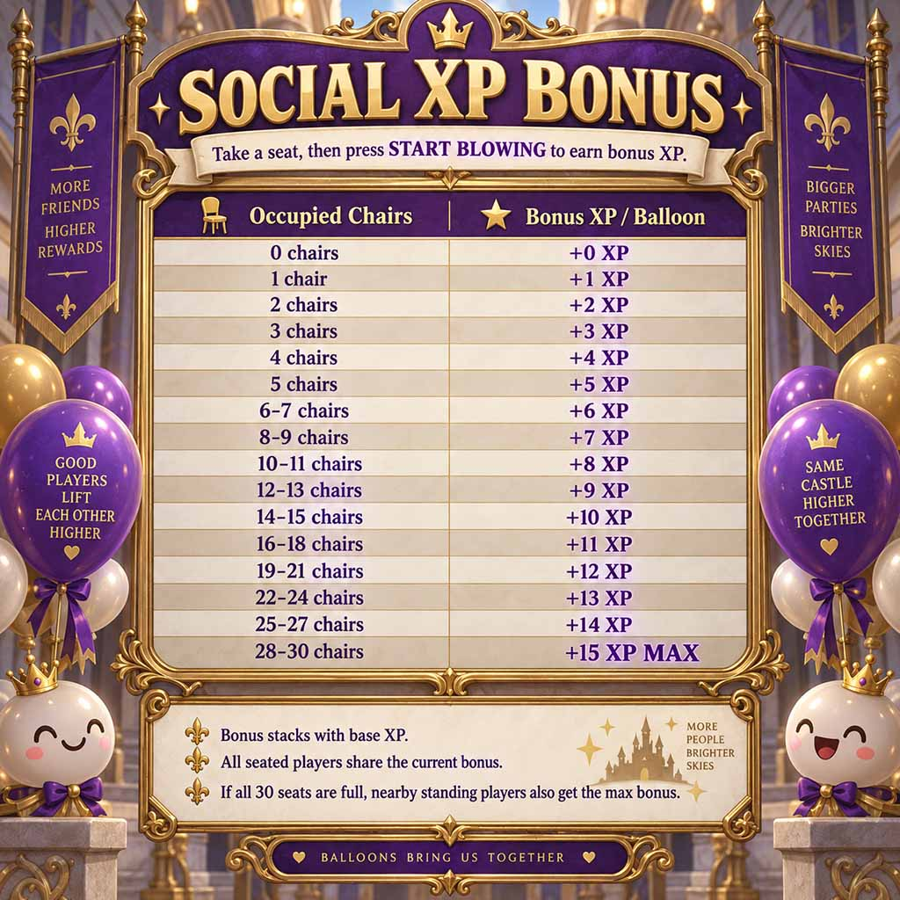

# DropParty

## Play live now in Decentraland

### [Open DropParty in the Decentraland app](decentraland://?realm=DropParty.dcl.eth)

Already in Decentraland? Open chat and enter `/world DropParty.dcl.eth`.



DropParty is a multiplayer Decentraland game about keeping the castle supplied with balloons, building your balloon-blowing reputation, and showing up when the Drop Party goes live.

## The quick version

1. Find Old Pete upstairs and accept the job.
2. Start blowing balloons from the on-screen balloon HUD.
3. Fill your balloon bundle, then return to Old Pete to turn it in.
4. Check the upcoming-party board and head downstairs when a Drop Party begins.
5. Get close to event balloons and use **POP** for a chance at party prizes.


## Start your shift with Old Pete

Old Pete is the castle’s balloon boss. Visit him upstairs when you arrive and accept the Help Wanted prompt to become an employee. He gives new employees their first handful of balloons and opens up the blowing loop.

If you are already employed, Old Pete is also where you return after a full balloon run. His prompt will guide you when it is time to turn in.

## Blow balloons

Use the **START BLOWING** button in the balloon HUD to begin. The HUD shows your current level, XP, Balloon Points (BP), balloons held, and the time until the next balloon is completed. You can use **STOP BLOWING** whenever you want to pause.

Each completed balloon adds to your carried bundle and advances your progress:

- You earn XP and 1 BP for every completed balloon.
- Your level is based on total XP.
- The default bundle holds 10 balloons. Some equipped kite perks may change your capacity or progression bonuses.
- The blower leaderboard celebrates the castle’s most dedicated balloon makers.

Blowing is a pre-party activity. When a Drop Party is active, the game pauses balloon blowing so everyone can focus on the event.

## Blow together for Social Bonus XP


The long table is the best place to work a shift with friends. Sit in a chair at the table, start blowing, and your balloon HUD will show the number of occupied seats and your current **SOCIAL BOOST**.

Every occupied chair raises the group bonus for eligible players who are blowing at the table. The boost is added to the XP earned when a balloon is completed, so a larger crew progresses faster together. The bonus starts at `+1 XP` with one seated player, grows as more chairs are filled, and reaches a maximum of `+15 XP` when all 30 chairs are occupied.



If every chair is full, players gathered around the table can also share the maximum Social Bonus while blowing. Keep an eye on the HUD: it shows both the seated count and the exact `SOCIAL BOOST +XP` currently applied to your next completed balloon.

## Turn in a full bundle

When your held-balloon counter is full, the HUD will tell you to return to Old Pete upstairs. Interact with him, complete the on-screen turn-in prompt, and hand over the full bundle.

Turning in resets your carried-balloons counter to zero so you can start another shift. Your earned XP, level, Balloon Points, and lifetime balloon total remain yours.

## Join a Drop Party

The **Upcoming Drop Parties** board shows upcoming public and hosted events in your local time. Browse a party to see its details and prize preview, then come downstairs when the countdown reaches **LIVE**.

During an active Drop Party, event balloons appear in the play area. Move close to a balloon and use the **POP** prompt - on desktop, `E` can also activate it. You do not need to aim precisely at the balloon; being nearby is what matters.

Every event balloon can be claimed only once, so crowded parties are a race to get close and pop. After a successful pop, the game reveals the result and records any win to your profile. Check **My Wins** in the party menu to review your results.

## Host a custom Drop Party

There are two public Drop Parties every day, so everyone can join the action without hosting or contributing anything. Prize deposits are completely optional—they are not required to play, blow balloons, or attend a party.

To create your own custom Drop Party, your avatar must own an eligible wearable. Currently, the eligible wearable is the **DCL Raffle Manager**. Eligible holders can create a party, choose its details, and build its prize pool.

Any player can help stock a Drop Party by contributing prizes such as wearables, emotes, or MANA. Contribute only when you want to support a party: it is a way to add to the event’s prize pool, not a requirement for gameplay.

After a hosted party ends, its host decides what happens to unclaimed hosted prizes:

- **Release to the Extra Pool** so they can help support future Drop Parties.
- **Reserve them** for the next custom Drop Party they create.


## Progression and rewards

Balloon blowing is a long-term progression track. Every completed balloon earns 1 BP, and you can spend BP in the in-game Rewards catalog once you meet an item’s level requirement.

### Kite rewards available now

The current BP redemption rewards are kites. A kite perk becomes active when you equip that kite and reach its listed level requirement. The HUD shows the active kite bonus while you blow balloons.

| Kite | Unlock | Cost | Active perk |
| --- | ---: | ---: | --- |
| Green Dragon Kite | Level 5 | 100 BP | +2 XP per balloon |
| Decentraland 2.0 Kite | Level 10 | 250 BP | +5 XP per balloon |
| Red Dragon Kite | Level 15 | 400 BP | +5 XP per balloon and a 12-balloon carry capacity |

Availability and stock are shown in the in-game Rewards catalog.

### Perks from existing kites

Some earlier kites may be sold out and are not currently BP-redemption rewards, but their perks still work for players who own and equip them:

| Kite | Required level | Active perk |
| --- | ---: | --- |
| Lava Kite | 20 | +5 XP per balloon; 15-balloon carry capacity |
| Frost Dragon Kite | 25 | +7 XP per balloon; 18-balloon carry capacity |
| Black Dragon Kite | 30 | +9 XP per balloon; 20-balloon carry capacity |
| Cross Joint Kite | 40 | +10 XP per balloon; 20-balloon carry capacity; balloons complete 5 seconds faster |

Only your highest-level eligible equipped kite applies at a time.

### More balloon wearables are coming

Balloon wearables will be released in a future update. They will add more ways to spend BP and bring additional perks to the balloon-blowing loop. Check the Rewards catalog in-game for the current collection, requirements, and availability.

## Good to know

- Drop Party times are displayed in your local time zone.
- Stand on event balloons to make POP appear; hurry, another player may claim it first.
- A full carried bundle must be turned in before you can keep blowing.
- Party-specific prompts and the HUD are the source of truth for the current event state.


## Project contents

- `scene/` — the Decentraland scene, artwork, and multiplayer game client.
- `dcl-server/` — the companion Decentraland server source.


## Run or deploy the scene

From the `scene` directory:

```powershell
npm install
npm start
# or
npm run deploy
```
